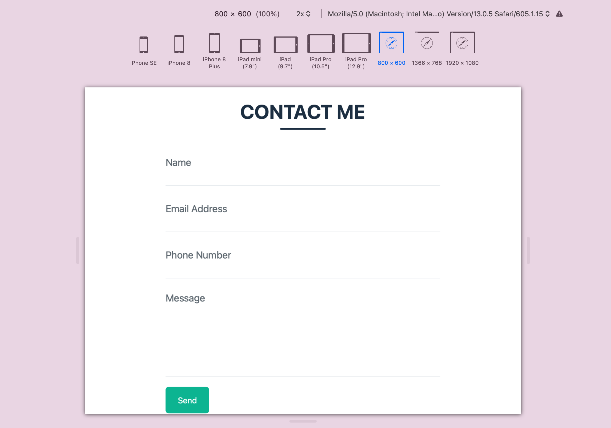

# Lab 10 - A Responsive Contact Me Form Design
# CISC 3140

This is a simple HTML contact form, including a CSS script for styling, and JavaScript code for validation.

This contact form can be applied to personal portfolio website.

### About the HTML markup
The HTML code creates a basic contact form that asks for a Name, Phone Number, Email, and Message.

### About the CSS script
The CSS script is a separate file that is located in the css/styles.css, and was linked to the index.html. The CSS script is used to style the HTML contact form.

### About the JS
Data validation is the process of ensuring that user input is clean, correct, and useful.
If a form field is empty, the JS function alerts a message, e.g. Please enter your name, and returns false, to prevent the form from being submitted.

### Responsive Form with CSS
Resize the browser window and the contact form is rendered normally. In the HTML file, add inputs with a matching label for each field, and wrap a \<div\> element  around each label and input to set a specified width with CSS.

## Screenshots

